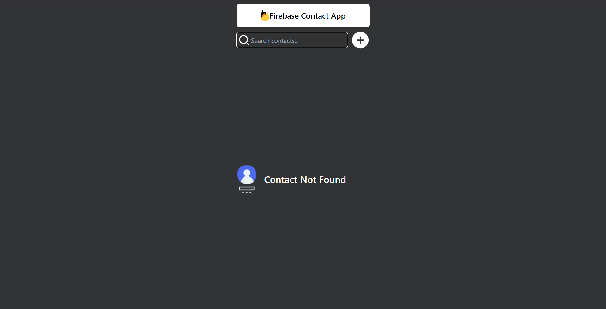
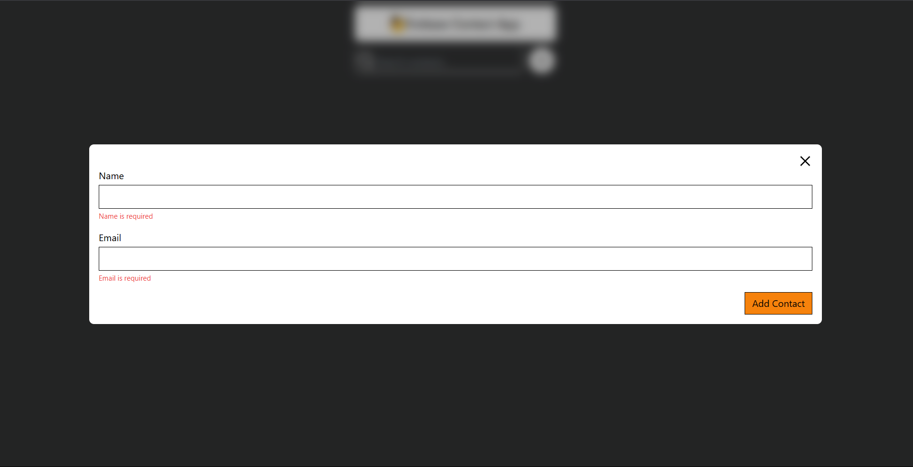
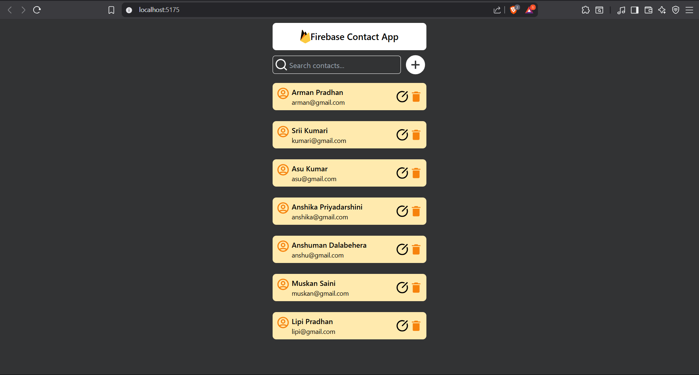
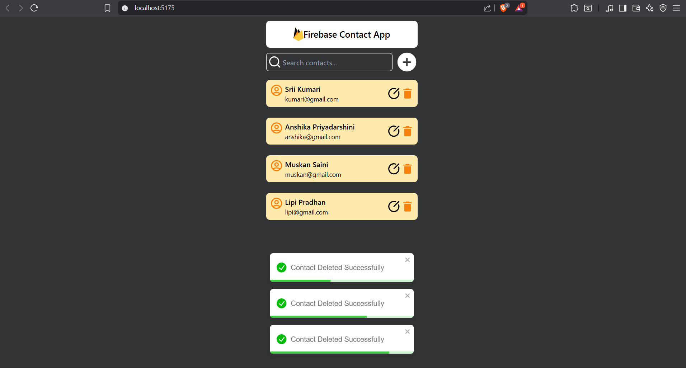

# QuickConnect 📇

A simple and modern contact management application built using **React**, **TailwindCSS**, and **Firebase**. Easily add, update, delete, and search your contacts with a clean user interface and real-time database.

---

## 🔥 Features

- 🔍 Search contacts in real-time
- ➕ Add new contacts with validation
- 📝 Update existing contact info
- 🗑️ Delete contacts from Firestore
- 🌐 Firebase Firestore integration
- 🧠 Form validation using Formik & Yup
- 💅 Styled with Tailwind CSS

---

## 📸 Screenshots






## 🚀 Tech Stack

- **Frontend:** React.js, TailwindCSS
- **Backend:** Firebase Firestore
- **Form Handling:** Formik
- **Validation:** Yup
- **Icons:** React Icons
- **Notifications:** React Toastify

---
## 🔐 Firebase Setup

1. Go to [Firebase Console](https://console.firebase.google.com/)
2. Create a new project (or use existing one)
3. Enable **Firestore Database**
4. Replace your Firebase config in:

/config/firebase.js

Example:
```js
export const firebaseConfig = {
  apiKey: "YOUR_API_KEY",
  authDomain: "YOUR_AUTH_DOMAIN",
  projectId: "YOUR_PROJECT_ID",
  storageBucket: "YOUR_BUCKET",
  messagingSenderId: "YOUR_MSG_ID",
  appId: "YOUR_APP_ID"
};


---

## 🛠️ Setup Instructions

```bash
# Clone the repo
git clone https://github.com/AnshCyberSec/QuickConnect.git
cd QuickConnect


# Install dependencies
npm install

# Run the development server
npm start


👉 Already connected to Firebase project: **vite-contact**

🙌 Author
Name : Anshuman Dalabehera
Email: anshumananshuman63@gmail.com